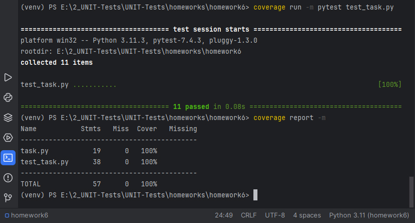

### Отчет о выполнении задания

> *- [Код программы](https://github.com/Bandurko/UNIT-Tests/blob/main/homeworks/homework6/task.py)*

> *- [Код тестов](https://github.com/Bandurko/UNIT-Tests/blob/main/homeworks/homework6/test_task.py)*

> *- Отчет о покрытии тестами*
> 
> 

#### *- Объяснение того, какие сценарии покрыты тестами*

При написаании тестов, я руководствовался тест-планом, включающим в себя все возможные сценарии тестироания:

>* Тест правильной инициализации класса;
>* Тест средних значений списков размером больше 1;
>* Параметризованный тест средних значений, если один или оба списка пустые;
>* Параметризованный тест средних значений, если один или оба списка имеют только один элемент;
>* Тест выдачи сообщения 'Первый список имеет большее среднее значение';
>* Тест выдачи сообщения 'Второй список имеет большее среднее значение';
>* Тест выдачи сообщения 'Средние значения равны'.